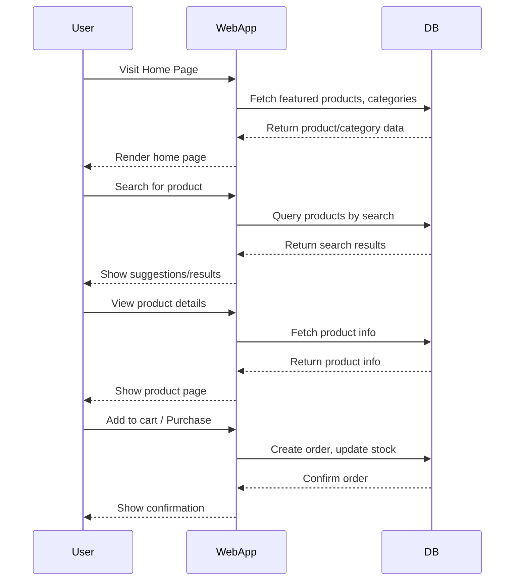

# PHIBMAT e-Store school project

Welcome to **PHIBMAT e-Store**, a modern e-commerce web application built with Symfony, Bootstrap 5, and Font Awesome.  
This project provides a robust foundation for online shopping, including user management, product categories, roles, and a visually appealing, responsive UI.

---

## Table of Contents

- [Features](#features)
- [Installation](#installation)
- [Usage](#usage)
- [Database Structure](#database-structure)
- [Sequence Diagram](#sequence-diagram)
- [Project Structure](#project-structure)
- [Customization](#customization)
- [Contributing](#contributing)
- [License](#license)

---

## Features

- Responsive Bootstrap 5.3 design
- Font Awesome icons and animated backgrounds
- User authentication and roles
- Category and product management
- Admin dashboard with navigation
- Search with suggestions (AJAX-ready)
- Featured products section

---

## Installation

1. **Clone the repository:**
   ```sh
   git clone https://github.com/yourusername/e-store.git
   cd e-store
   ```

2. **Install PHP dependencies:**
   ```sh
   composer install
   ```

3. **Install Node dependencies (for assets):**
   ```sh
   npm install
   npm run dev
   ```

4. **Configure your `.env` file:**
   - Set your database credentials (e.g., `DATABASE_URL`).

5. **Create the database and run migrations:**
   ```sh
   php bin/console doctrine:database:create
   php bin/console doctrine:migrations:migrate
   ```

6. **Load fixtures (optional):**
   ```sh
   php bin/console doctrine:fixtures:load
   ```

7. **Run the Symfony server:**
   ```sh
   symfony server:start
   ```
   or
   ```sh
   php -S localhost:8000 -t public
   ```

---

## Usage

- Visit `http://localhost:8000` in your browser.
- Register or log in as an admin to access the dashboard.
- Manage categories, products, users, and roles from the admin panel.
- Use the search bar on the home page to find products.

---

## Database Structure

**Main Entities:**
- **User**: id, email, password, code, name, roles, role (relation to Role)
- **Role**: id, code, label, description, users (OneToMany)
- **Category**: id, code, label, description
- **Product/Item**: id, code, label, description, price, category (relation to Category), etc.

**Relationships:**
- User ↔ Role: ManyToOne (a user has one role, a role has many users)
- Product ↔ Category: ManyToOne (a product belongs to a category)

---

## Sequence Diagram

Below is a simplified sequence diagram for the "User purchases a product" flow:



---

## Project Structure

```
EcommerceSchoolProject/
├── assets/
├── migrations/
├── public/
├── src/
│   ├── Controller/
│   ├── Entity/
│   ├── Form/
│   └── Repository/
├── templates/
│   ├── base.html.twig
│   ├── home/
│   ├── category/
│   ├── user/
│   ├── role/
│   └── partials/
├── tests/
├── translations/
├── var/
├── vendor/
└── README.md
```

---

## Customization

- **Styling:** Edit `assets/styles/app.css` or use Bootstrap utility classes.
- **Icons:** Use any Font Awesome icon by changing the class in your Twig templates.
- **Entities:** Add or modify entities in `src/Entity/` and update with Doctrine migrations.

---

## Contributing

Pull requests are welcome! For major changes, please open an issue first to discuss what you would like to change.

---

## License

[PHIBMAT UNIVERSITY DOUALA](https://phibmat.com/)

---